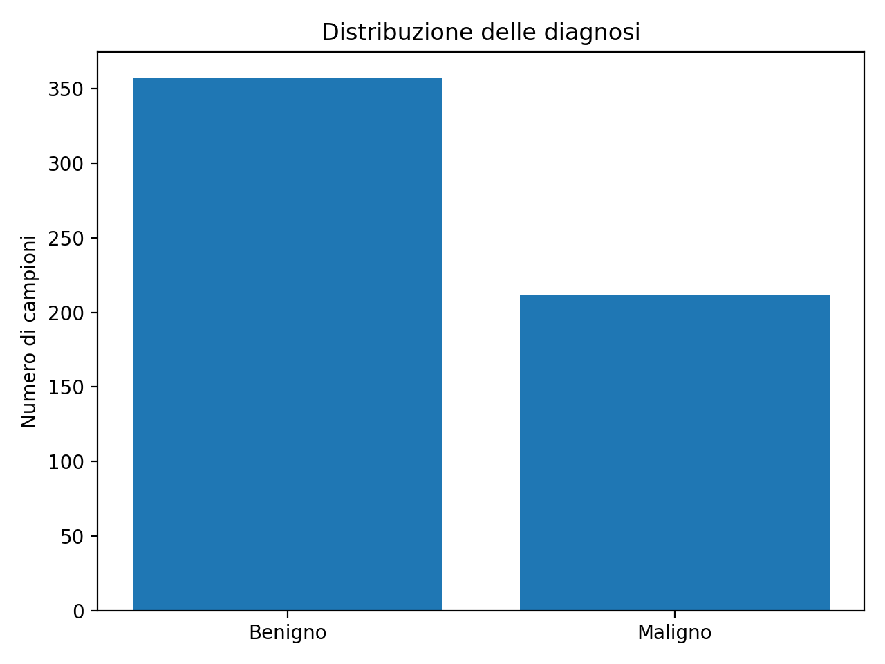

<div align="center">
  <h1> BinaryCancerDiagnostic</h1></br>
</div>
<div align="center">
  
  
  <br/>
  <br/>
  
  
  
  
  
  
  
</div>

---

This project implements a binary breast cancer diagnosis system using Machine Learning techniques. The dataset contains features extracted from digitized images of breast tissue samples, used to classify tumors as benign (B) or malignant (M). The project includes a data cleaning and exploratory analysis phase, followed by the implementation and comparison of two classification models: Logistic Regression and Support Vector Machine (SVM). For each model, detailed reports are generated with performance metrics, ROC curves, confusion matrices, and feature importance analysis, providing a comprehensive evaluation of the predictive capabilities of each algorithm.


---
## Medical Disclaimer
This project is developed for **educational and research purposes only**.  
It is **not intended for clinical use**, diagnosis, treatment, or medical decision-making.  
Any predictions or analyses produced by the models should not be used as a substitute for professional medical advice.

---


## How to Clone the Repository
```bash
git clone https://github.com/Kizorat/BinaryCancerDiagnostic
cd BinaryCancerDiagnostic
```

## How to Set Up the Environment
1. Create a Python virtual environment:
```bash
python -m venv venv
```

2. Activate the virtual environment:
   - **Windows:**
     ```bash
     venv\Scripts\activate
     ```
   - **Linux/Mac:**
     ```bash
     source venv/bin/activate
     ```

3. Install dependencies:
```bash
pip install -r requirements.txt
```

## What Has Been Done
- **Data Cleaning**: We started by preprocessing the raw dataset to prepare it for analysis. This involved handling missing values, removing unnecessary columns, and normalizing features to ensure consistent data quality across all variables.

- **Exploratory Analysis**: We performed a detailed exploration of the dataset through statistical summaries and visualizations. This helped us understand the distribution of features, identify correlations between variables, and discover patterns that could be useful for the classification task.

- **Logistic Regression Model**: We implemented and trained a Logistic Regression classifier to predict whether tumors are benign or malignant. The model was evaluated using various performance metrics, and we analyzed which features were most important for making accurate predictions.

- **Support Vector Machine (SVM)**: We developed an SVM model with RBF kernel as an alternative approach to the classification problem. The model was optimized and tested to compare its performance against the Logistic Regression model.

- **Performance Comparison**: We compared both models using accuracy, precision, recall, F1-score, and ROC curves to understand their strengths and weaknesses. All results, including confusion matrices, feature importance rankings, and performance metrics, were saved as reports and visualizations in dedicated folders.

# Dataset
Dataset source: [Breast Cancer Wisconsin (Diagnostic) Data Set](https://www.kaggle.com/datasets/uciml/breast-cancer-wisconsin-data)

The dataset contains numerical features extracted from diagnostic images, associated with a target variable called 'diagnosis':
- `B` -> Benign tumor  
- `M` -> Malignant tumor 

## Dataset Cleaning 
Preprocessing is performed using the 'cleaning_dataset.py' script and includes:
- Removal of completely empty columns
- Duplicate removal
- Handling of missing values 

The final cleaned dataset is saved as: 
```text 
dataset/clean_data.csv
```

# Exploratory Data Analysis
Exploratory analysis is implemented in ``` dataset_Analysis.py ``` and is essential to understand why the classification models achieve such high performance.

## Class Distribution

The class distribution plot **(Figure 1)** shows that benign samples are more frequent than malignant ones, but the dataset is not severely imbalanced.</br>  
<div align="center"> 
   </br>
Figure 1: Diagnostic distribution of benign and malignant samples. 
</div>
</br>
This is important because:
it reduces bias toward the majority class;
it makes metrics such as accuracy and AUC-ROC more reliable.

## Relationships Between Main Features (Pairplot)

The pairplot **(Figure 2)** highlights strong relationships between morphological features, particularly: radius_mean, perimeter_mean, and area_mean, which are highly correlated; a clear separation between benign and malignant samples in feature space.

<div align="center"> 
   </br>
Figure 2: Shows pairwise relationships between area,perimeter and concavity mean.
</div>
</br>

This explains why even relatively simple models can perform well on this task.

# Scatter Plot and Class Separability

The scatter plot **(Figure 3)** shows that:
- malignant tumors tend to have higher average radius and concavity values;
- benign tumors are concentrated in a compact region with lower values.

<div align="center"> 
   </br>
Figure 3: Show the relationship between malignant (M) and benign (B) samples.
</div>
</br>

This visual separation anticipates the effectiveness of non-linear classifiers such as SVM.

# Comparison of Feature Means
The bar chart shows that all main features have higher average values for malignant tumors.

In particular:
area_mean exhibits a very pronounced difference between classes;
concavity_mean and concave points_mean are close to zero for benign cases.

These differences make the classification problem ***highly*** discriminative.

## Principal Component Analysis (PCA)
<div align="center"> 
   </br>
Figure 4: PCA is used to reduce dimensionality and analyze the global structure of the data.
</div>
</br>
The cumulative variance plot **(Figure 4)** shows that over 90% of the variance is explained by only a few principal components.

<div align="center"> 
   </br>
Figure 5: PCA of the global structure of the data.
</div>
</br>

The 2D projection **(Figure 5)** reveals a clear separation between benign and malignant samples even in two dimensions.

This confirms that discriminative information is highly concentrated and easily exploitable by classification models.

# Supervised Classification Models

After completing the exploratory data analysis, supervised learning models are applied to quantify the separability observed in the data.

Two classification approaches are considered:
- **Logistic Regression**, used as an interpretable baseline model
- **Support Vector Machine (SVM)**, employed to capture more complex, non-linear relationships

This progressive approach allows both performance comparison and deeper understanding of the underlying data structure.

---

## Logistic Regression Model
The `logistic_regression.py` script implements a **Logistic Regression** classifier for distinguishing between benign and malignant tumors.

The model pipeline includes:
- Standardization of input features using `StandardScaler`
- Stratified train/test split to preserve class proportions
- Class imbalance handling via `class_weight='balanced'`

### Performance
- **Accuracy**: 98%  
- **AUC-ROC**: 99%

These results indicate strong discriminative capability, despite the linear nature of the model.

### Results Analysis
The following analyses are produced:

<div align="center"> 
   </br>
Figure 6: Logistic Regression results.
</div>
</br>

- **Confusion Matrix**  
  The confusion matrix shows near-perfect classification performance, with only one false positive.
- **ROC Curve**  
  The ROC curve shows a high true positive rate with a very low false positive rate, confirming the robustness of the classifier.

- **Feature Importance**  
  Feature importance is derived from the absolute value of the model coefficients.  
  The most influential features are related to:
  - texture-related measurements
  - radius and perimeter features
  - concavity-based descriptors  

These findings are consistent with the exploratory data analysis and domain knowledge.

---

## Support Vector Machine (SVM)

The `SVM.py` script implements a **Support Vector Machine** classifier with a **Radial Basis Function (RBF) kernel**, allowing the model to capture non-linear relationships in the data.

The SVM pipeline includes:
- Feature scaling via `StandardScaler`
- Hyperparameter optimization using `GridSearchCV`
- Balanced class weights to handle class imbalance

### Performance
- **Accuracy**: 99%  
- **AUC-ROC**: 99%  

This model achieves the **best overall performance** in the project.

### Results Analysis
The following outputs are generated:

- **Confusion Matrix, ROC Curve, and Probability Distribution**  
<div align="center"> 
   </br>
Figure 7: SVM results.
</div>
</br>

- **Feature Importance (Permutation Importance)**  
  Permutation importance highlights features associated with tumor size, shape, and concavity as the most discriminative.

- **Confusion Matrix Interpretation**
The confusion matrix shows almost perfect classification performance.  
Notably, the model produces **no false positives**, meaning that no benign tumors are incorrectly classified as malignant. 
Although **only one false negative** is observed, this aspect is clinically relevant, as false negatives may delay diagnosis and treatment.</br>
This result is particularly relevant in a medical context, where minimizing misclassification is crucial.
</br>  

Compared to logistic regression, the SVM demonstrates superior ability to model complex decision boundaries, resulting in fewer misclassifications, especially for malignant cases.

---

## Final Notes:
This project demonstrates that the analyzed medical dataset is **highly informative and well-structured** for binary classification.

Key conclusions include:
- Exploratory Data Analysis reveals strong separability between benign and malignant samples
- A small subset of features already contains most of the discriminative information
- **Logistic Regression** performs well and provides interpretability
- **Support Vector Machine** achieves the best results, confirming the presence of non-linear relationships in the data

Overall, the SVM model is recommended as the final classifier for this task.  
Future work may include clustering-based validation, feature sufficiency analysis, and model generalization studies on external datasets.

---

Together, these models allow us to assess both linear and non-linear decision boundaries and to evaluate the trade-off between interpretability and predictive performance.


## Project Authors

- **Grazia Di Pietro** - MSc student in Data Science and Machine Learning - [GitHub](https://github.com/GracyDP)
- **Luca Giuliano** - MSc student in Data Science and Machine Learning- [GitHub](https://github.com/Kizorat)

---
*Project developed for academic purposes - Year 2025*